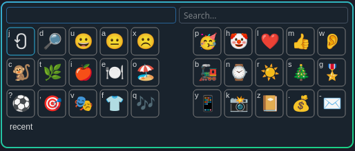
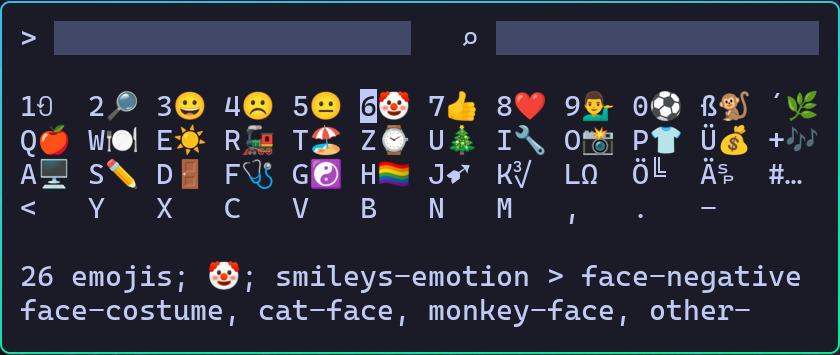

# Emoji Kbd

It is all about efficiency - the fewer keys you need to type the better.
Emoji Kbd is made for efficiency.

Three key presses are enough to get an emoji from the recent list:
1. Press hotkey <kbd>Win-.</kbd> to open Emoji Kbd
2. Press <kbd>key</kbd> of associated emoji
3. Press <kbd>Enter</kbd> to close and insert

# Screenshots

The gui with DE layout


The gui with Corne Bone layout



In the terminal - use kitty for best results - other terminals do not handle all graphemes,
e.g ghostty work mostly, alacritty not so well - you will see miss alignment of columns.
You may also need to play with font config to get Noto Color Emoji available in your terminal.



and have fun using it. 😉

# UI

Top left is the emoji input field and on the right the search field.

In the middle is a (key)board like overview of emoji groups or emojis. 
Each one has a <kbd>key</kbd> associated with it that opens the group or inserts the emoji.

At the bottom is a status field showing information about the selected emoji.

Closing will copy the content of the input field to the clipboard and print it to stdout.

If your window manager supports it, a left click in left half of status allows for moving the window and in right half allows for resizing.

# Key bindings

| Key 🖮                                              | Action                           |
|-----------------------------------------------------|----------------------------------|
| **Global**                                                                             |
| <kbd>Cursor</kbd>, <kbd>Home</kbd>, <kbd>End</kbd>  | navigate around                  |
| <kbd>Ctrl-I</kbd>                                   | focus input                      |
| <kbd>Ctrl-F</kbd>                                   | focus search                     |
| <kbd>PageUp</kbd>/<kbd>PageDown</kbd>               | scroll pages                     |
| <kbd>Esc</kbd>                                      | back to previous board           |
| <kbd>Space</kbd>                                    | prefix key                       |
| **Input**                                                                              |
| key on board                                        | select and insert emoji          |
| <kbd>Enter</kbd>                                    | close and print result           |
| <kbd>Right</kbd> at end                             | focus search                     |
| <kbd>Tab</kbd>, <kbd>Down</kbd>                     | focus board                      |
| **Search**                                                                             |
| <kbd>Enter</kbd>                                    | insert emoji and back to input   |
| <kbd>Right</kbd> at end                             | select next result               |
| <kbd>Left</kbd> at start                            | focus input                      |
| <kbd>Tab</kbd>, <kbd>Down</kbd>                     | focus board                      |
| **Board**                                                                              |
| key on board                                        | select and insert emoji          |
| <kbd>Enter</kbd>                                    | insert emoji                     |
| <kbd>Up</kbd> in first row                          | focus input                      |
| **Recent Board** additional keys                                                       |
| key on board                                        | select and insert emoji          |
| <kbd>Shift</kbd>+<kbd>Left</kbd>/<kbd>Right</kbd>   | move selected left/right         |
| <kbd>Shift</kbd>+<kbd>Enter</kbd>                   | toggles favorite state           |
| <kbd>Shift</kbd>+<kbd>Delete</kbd>                  | delete selected                  |
| **Mouse** 🖱️                                                                           |
| <kbd>LeftClick</kbd>                                | insert emoji                     |
| <kbd>LeftClick</kbd> in upper right corner          | open variants                    |
| <kbd>DoubleLeftClick</kbd>                          | insert emoji and close           |
| <kbd>RightClick</kbd>                               | back to previous board           |
| <kbd>Wheel</kbd>                                    | scroll pages                     |

# Recent List ⟲

Used emojis will be put automatically to the recent list.

Every item has a score and items are sorted by score when opening the recent board.

A score >= 100 makes an item a favorite and it will not change anymore.

When an item is inserted into the input its score will increase by 10 and the score of all others - except favorite - decreases by 1.

# Search 🔎

When entering search without a pattern it will display all available emojis.

With a pattern it will show matching items in the order of their score and select the first result.

# Requirements

Install:
- Python 3.12+
- [Noto Color Emoji](https://github.com/google/fonts/raw/refs/heads/main/ofl/notocoloremoji/NotoColorEmoji-Regular.ttf) font

# Building

```shell
python -m venv venv
. venv/Scripts/activate
pip install -r requirements.txt
python src/guikbd.py # for testing
python src/termkbd.py # for testing
```

# Installation

Integration into your system works with one of the scripts in `scripts/*`.

## Linux Hyprland

Install:
- `nc` (netcat)
- `wl-copy`
- `wtype`
- `kitty`

In Arch by:
```shell
sudo pacman -S openbsd-netcat wl-clipboard wtype kitty
```

Add to `~/.config/hypr/bindings.conf` for the hotkey
```toml
unbind = SUPER, period
#bindd = SUPER, period, Emojis, exec, PATHTO/scripts/emoji-kbd-gui-wl
bindd = SUPER, period, Emojis, exec, PATHTO/scripts/emoji-kbd-kitty-hl-open
#bindd = SUPER, period, Emojis, exec, PATHTO/scripts/emoji-kbd-ghostty-hl-open
```

Add to `~/.config/hypr/hyprland.conf` for fast opening and floating window
```toml
windowrulev2 = tag -floating-window, title:^Emoji Kbd$
windowrulev2 = tag -terminal, title:^Emoji Kbd$
wwindowrulev2 = noanim, title:^Emoji Kbd$
windowrulev2 = float, title:^Emoji Kbd$
windowrulev2 = center, title:^Emoji Kbd$
windowrulev2 = unset size, title:^Emoji Kbd$
# you may need to set/adjust the size also
#windowrulev2 = size 600 285, title:^Emoji Kbd$
#windowrulev2 = minsize 500 200, title:^Emoji Kbd$
#windowrulev2 = maxsize 800 400, title:^Emoji Kbd$
```

Optionally copy `res/emoji-kbd.desktop` to `~/.local/share/applications/`
for a launcher entry and adjust the paths in the copied file.

## Windows

Install:
- [Autohotkey v2](https://autohotkey.com/)

Run:
```
emoji-kbd.ahk
```
It will overwrite <kbd>Win-.</kbd>, i.e. the Windows emoji picker.
If you prefer another hotkey edit the script.

## Terminal

In the terminal you may also use the terminal-only version:
```shell
python src/termkbd.py
```
or the daemon like terminal - using a kitty terminal which is hidden/shown by hyprctl:
```shell.
./scripts/emoji-kbd-kitty-hl-open
```
or start the gui:
```shell
python src/guikbd.py
```
or start the gui via daemon for faster opening - use "GET" to wait for result or "SHOW" to just show gui:
```shell
./scripts/emoji-kbd-gui-wl
```

# Customization

Edit `~/.config/emoji-kbd/emoji-kbd.toml`

For everything change the code 😉 or wait until it is added.

# Other files

- `~/.local/state/emoji-kbd/recent.txt` the recent list.
- `~/.local/state/emoji-kbd/*.log` the log files.
- `~/.cache/emoji-kbd/*` openmoji.csv and UnicodeData.txt "databases"

# Development

When the environment variable `EMOJI_KBD_DEV` is set to a value the config file is taken from `res/emoji-kbd.toml` and all other files go to `.local` in the source tree.


# Alternatives

I started to use emojis with Windows 10 but disliked the new picker from Windows 11 as it had a much smaller recent list.

Looking for alternatives I found https://github.com/gilleswaeber/emoji-keyboard from Gilles Weber and added the recent emojis board and was very happy with it for years.

But when switching back to Linux for the desktop I could not find a proper alternative and thus made my own one - Emoji Kbd - inspired by Gilles.

I like Walker, but not the emoji picker.

# Todos

- Add more board layouts

# Random link list

- https://raw.githubusercontent.com/hfg-gmuend/openmoji/refs/heads/master/data/openmoji.csv
- https://www.unicode.org/Public/UCD/latest/ucd/UnicodeData.txt
- https://github.com/googlefonts/noto-emoji/issues/90?utm_source=chatgpt.com
- https://debuggerboy.com/emoji-fonts-for-alacritty-in-debian-11/
- https://github.com/alacritty/alacritty/issues/3975 
