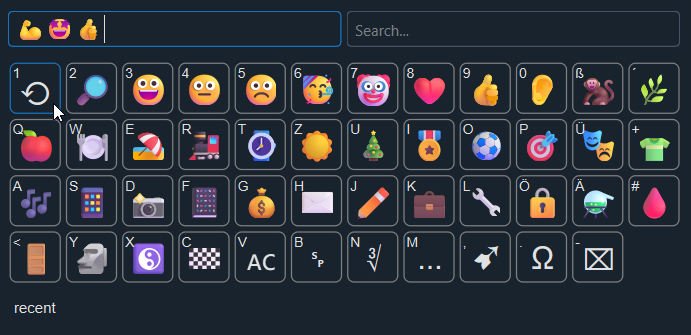

# Emoji Kbd
It is all about efficiency - the fewer keys you need to type the better.
Emoji Kbd is made for efficiency.
Pick emojis and characters with three key presses.



or for a custom keyboard


Just three key presses should be enough to get an emoji (from the recent list):
1. Open picker with a hot key
2. Select emoji with associated key
3. Close and insert with Enter

# UI
Top left is the emoji input field, right the search field.

In the middle is a (key)board like overview of emojis.
Each one has a key in the left upper corner.

At the bottom is a status field.

# How To Use
<kbd>Space</kbd> is a prefix key to allow for opening variants, e.g. skin tones.
Use the cursor keys, <kbd>Tab</kbd>, <kbd>Home</kbd> and <kbd>End</kbd> to navigate around.
Use <kbd>PageUp</kbd>/<kbd>PageDown</kbd> to switch pages.
Use <kbd>Esc</kbd> to go back to previous board.

In the input field, a <kbd>key</kbd> press will insert the associated emoji.
<kbd>Enter</kbd> will copy the emojis to the clipboard and close the window.

In the board, a <kbd>key</kbd> press will select the associated emoji.
<kbd>Enter</kbd> will insert the emoji in the input field.
Use <kbd>Esc</kbd>/<kbd>Backspace</kbd> to go back to previous board.

In the search field 🔎, <kbd>key</kbd> presses will insert a search term.
<kbd>Enter</kbd> will insert the first match in the input field and set focus to it again.
Cursor <kbd>Shift</kbd>+<kbd>Left</kbd> and <kbd>Shift</kbd>+<kbd>Right</kbd> (or <kbd>Right</kbd> when at end) change selected result.
<kbd>Enter</kbd> will insert the selected item and focus the input field again.

If your window manager supports it, a left click in left half of status allows for moving the window and in right half allows for resizing.

With the mouse 🖱️ a left click inserts/opens, a right click is back to previous board and a double click inserts and closes the window.

When the windows closes it will copy the content of the input field to the clipboard and print it to stdout.

# Recent List ⟲
Used emojis will be put automatically to the recent list.
Every item has a score and items are sorted by the score.
A score >= 100 makes a item a favorite which will not change anymore.
When using an item its score will increase by 10 and the score of all others decrease by 1.

<kbd>Shift</kbd>+<kbd>Left</kbd>/<kbd>Shift</kbd>+<kbd>Right</kbd> moves an item. <kbd>Delete</kbd> removes an item. <kbd>Shift</kbd>+<kbd>Enter</kbd> toggles favorite state.

# Search 🔎
When entering search without a pattern it will display all emojis.

With a pattern it will show matching items in the order of their score and select the first result.

# Requirements
- Python 3.12+
- [Noto Color Emoji](https://github.com/google/fonts/raw/refs/heads/main/ofl/notocoloremoji/NotoColorEmoji-Regular.ttf) font
- For Windows 11+ [Autohotkey v2](https://autohotkey.com/)
- For Linux netcat for fast opening.

# Building
```shell
python -m venv venv
. venv/Scripts/activate
pip install -r requirements.txt
python src/guikbd.py # for testing
```

# Installation
## Hyprland

In `~/.config/hypr/bindings.conf` add
```toml
unbind = SUPER, period
bindd = SUPER, period, Emojis, exec, PATHTO/scripts/wtype-emoji
```
and in `~/.config/hypr/hyprland.conf` add
```toml
windowrulev2 = float, class:^emoji-kbd$
windowrule = float, title:^Emoji Kbd$
```

## Windows
Run
```
ahk-emoji.ahk
```
It will overwrite `Win-.`, i.e. the Windows emoji picker.
If you prefer another hot key edit the script.

## Terminal
In the terminal you may also use the stripped down terminal-only version
```shell
python src/termkbd.py
```
or the gui
```shell
python src/guikbd.py
```
or the gui via daemon for fast opening
```shell
python src/guidmn.py get
```

# Customization
Fork and change the code 😉 or wait until it is added.

# Alternatives
I started to use emojis with Windows 10 but disliked the new picker from Windows 11 as it had a much smaller recent list.

Looking for alternatives I found https://github.com/gilleswaeber/emoji-keyboard from Gilles Weber and added the recent emojis board and was very happy with it for years.

But when switching back to linux for the desktop I could not find a proper alternative and thus made my own one - Emoji Kbd - inspired by Gilles.

I like Walker, but not the emoji picker.

# Todos
- Make size resizable
- Add config file
- Store config and other files in proper locations
- Add more layouts

# Random link list
- https://raw.githubusercontent.com/hfg-gmuend/openmoji/refs/heads/master/data/openmoji.csv
- https://www.unicode.org/Public/UCD/latest/ucd/UnicodeData.txt
- https://github.com/googlefonts/noto-emoji/issues/90?utm_source=chatgpt.com
- https://debuggerboy.com/emoji-fonts-for-alacritty-in-debian-11/
- https://github.com/alacritty/alacritty/issues/3975 wcwidth issues
